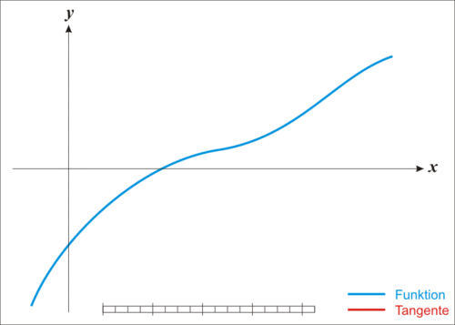

# Newton-Raphson Method

## Overview

The Newton-Raphson method is an iterative numerical technique for finding approximate solutions to real-valued functions. It is one of the most widely used methods for solving equations of the form \( f(x) = 0 \). The method is named after Isaac Newton and Joseph Raphson.

## Algorithm

  

The Newton-Raphson method uses the idea of linear approximation. If \( x_n \) is an approximation to a root of \( f(x) = 0 \), then a better approximation \( x_{n+1} \) is given by:

\[ x_{n+1} = x_n - \frac{f(x_n)}{f'(x_n)} \]

where:
- \( f(x) \) is the function for which we want to find the root.
- \( f'(x) \) is the derivative of \( f(x) \).

### Steps

1. **Initial Guess**: Start with an initial guess \( x_0 \).
2. **Iteration**: Compute the next approximation using the formula \( x_{n+1} = x_n - \frac{f(x_n)}{f'(x_n)} \).
3. **Convergence Check**: Check if the difference between \( x_{n+1} \) and \( x_n \) is within a predefined tolerance level. If yes, the process is stopped.
4. **Repeat**: If the convergence criterion is not met, set \( x_n = x_{n+1} \) and repeat the iteration.

### Example

Consider the equation \( x^2 - 2 = 0 \). We want to find the square root of 2.

1. **Function and Derivative**:
   \[ f(x) = x^2 - 2 \]
   \[ f'(x) = 2x \]

2. **Iteration Formula**:
   \[ x_{n+1} = x_n - \frac{x_n^2 - 2}{2x_n} \]

3. **Initial Guess**: Let's start with \( x_0 = 1 \).

4. **Iterations**:
   - \( x_1 = 1 - \frac{1^2 - 2}{2 \cdot 1} = 1.5 \)
   - \( x_2 = 1.5 - \frac{1.5^2 - 2}{2 \cdot 1.5} \approx 1.4167 \)
   - \( x_3 \approx 1.4142 \)

After a few iterations, the value converges to approximately 1.4142, which is the square root of 2.
