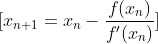

# Newton-Raphson Method

## Table of Contents
1. [Overview](#overview)
2. [Algorithm](#algorithm)
   - [Steps](#steps)
3. [Example](#example)
4. [References and Further Reading](#references-and-further-reading)
5. [Usage Instructions](#usage-instructions)

## Overview

The Newton-Raphson method is an iterative numerical technique for finding approximate solutions to real-valued functions. It is one of the most widely used methods for solving equations of the form \( f(x) = 0 \). The method is particularly useful for finding roots of nonlinear equations and is known for its fast convergence.

## Algorithm

<div style="text-align: center;">
  
</div>

The Newton-Raphson method uses the idea of linear approximation. If \( x_n \) is an approximation to a root of \( f(x) = 0 \), then a better approximation \( x_{n+1} \) is given by:



where:
- \( f(x) \) is the function for which we want to find the root.
- \( f'(x) \) is the derivative of \( f(x) \).

### Steps

1. **Initial Guess**: Start with an initial guess \( x_0 \).
2. **Iteration**: Compute the next approximation using the formula 
3. **Convergence Check**: Check if the difference between \( x_{n+1} \) and \( x_n \) is within a predefined tolerance level. If yes, the process is stopped.
4. **Repeat**: If the convergence criterion is not met, set \( x_n = x_{n+1} \) and repeat the iteration.

## Example

Consider the equation \( x^2 - 2 = 0 \). We want to find the square root of 2.

1. **Function and Derivative**:
   \[ f(x) = x^2 - 2 \]
   \[ f'(x) = 2x \]

2. **Iteration Formula**:
  

3. **Initial Guess**: Let's start with \( x_0 = 1 \).

4. **Iterations**:
  


After a few iterations, the value converges to approximately 1.4142, which is the square root of 2.

## References and Further Reading

- [Numerical Analysis by Richard L. Burden and J. Douglas Faires](https://www.amazon.com/Numerical-Analysis-Richard-L-Burden/dp/0538733519)
- [Wikipedia: Newton-Raphson Method](https://en.wikipedia.org/wiki/Newton%27s_method)
- [Numerical Recipes: The Art of Scientific Computing](https://www.cambridge.org/core/books/numerical-recipes/6F5B95C2C5F1F4B9D7A0C1D3E1E5BC5A)

## Usage Instructions

To use the provided MATLAB code for the Newton-Raphson method, follow these steps:

1. Ensure you have MATLAB installed on your system.
2. Clone this repository to your local machine using:
   ```sh
   git clone https://github.com/huukhai249/Newton-Raphson-Matlab.git
